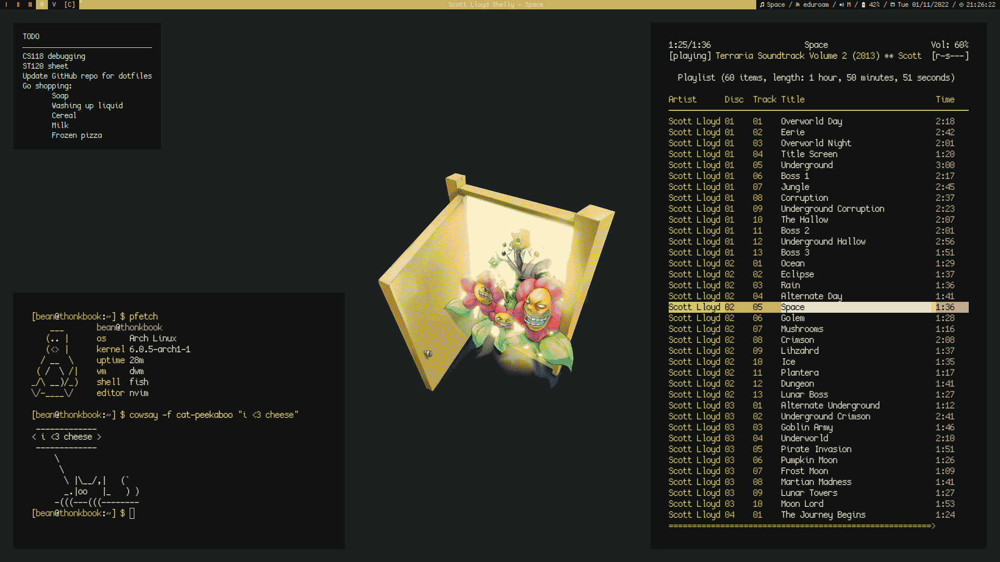

# ✨ Bean's Dotfiles

## Details
* Colourscheme - generated by pywal
* Font - cozette
* Window manager & bar - dwm
* Terminal -kitty
* Editor - neovim
* Fetch - hyfetch
* File manager - ranger
## Dependencies
### Necessary Dependencies
*Note: It is quite feasible that some dependencies are missing because I'm a fool.*

Most dependencies can be installed easily using a package manager. It is assumed you are using an Arch based distro. If not, package names may differ and you may need to find other ways to install dependencies that would be installed using an AUR helper.
```
# pacman -S git fish kitty neovim ranger dmenu qutebrowser scrot redshift libnotify picom pcmanfm feh zathura xorg-setxkbmap geoclue2 exa imagemagick xcolor neofetch discord steam
$ yay -S cozette-ttf pywal-discord farge tty-clock catclock
$ pip install pywal wal-steam adblock dbus-next hyfetch
```
The following dependencies instead need installing manually. Their respective websites are linked below.
- [Zathura-Pywal](https://github.com/GideonWolfe/Zathura-Pywal)
- [BetterDiscord](https://github.com/BetterDiscord/Installer)
- [eww](https://elkowar.github.io/eww/)
- [tty-stopwatch](https://github.com/thedpws/tty-stopwatch)
### Optional Dependencies
These dependencies are not necessary, but I would want them if I were to be setting up a new machine. Because of this, this section is mostly intended for my own use.
```
# pacman -S gimp zathura-pdf-mupdf zathura-cb lxappearance gimp lutris galculator htop wine mono blueberry
$ yay -S spotify oomox
```
## Installation
1. Set up fish shell

	1.1. Set fish as your default shell: `# chsh -s /usr/bin/fish`
	
	1.2. Install [fisher](https://github.com/jorgebucaran/fisher)

	1.3. Install [z](https://github.com/jethrokuan/z)

2. Installing dotfiles

	2.1. Clone this repository into your home directory: `$ git clone https://github.com/bean499/dotfiles .`

	2.2. Update the submodules: `$ git submodule update --init --recursive`

3. Installing dwm

	3.1. Change directory into the dwm folder: `$ cd dwm`

	3.2. Install dwm using the install script: `$ ./install.sh`

## Usage and Modification
- Programs are set to use the monospace font, so change the font in `~/.config/fontconfig/fonts.conf` to what you desire
- Colours are generated by pywal
	- Setting the wallpaper using the alias `setwall` will run various programs to make sure several programs are using the new theme
	- You will need to recompile dwm for the colour changes to show
	- To get a GTK theme of the current pywal colours, use `oomox` (listed as an optional dependency)
